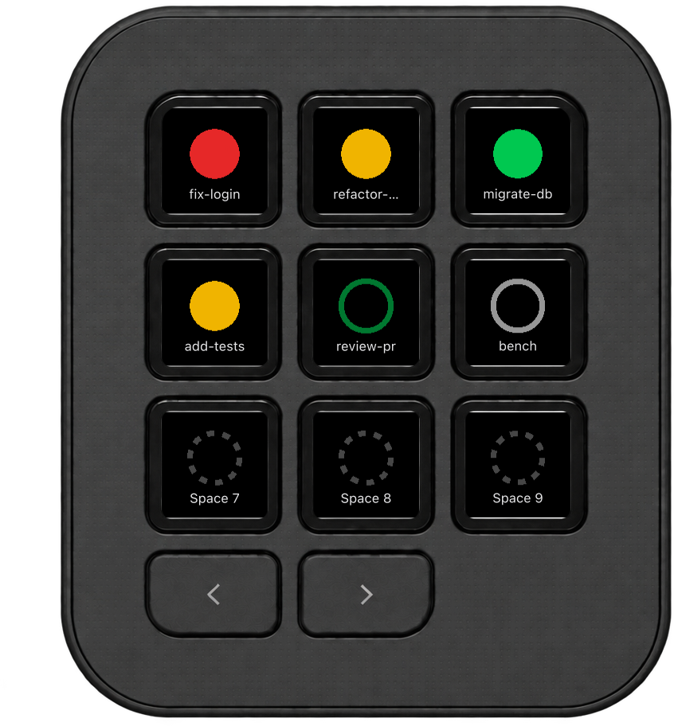
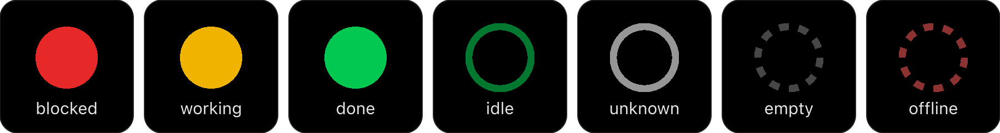

# Herdr Agents for the Logitech MX Keypad

Live status of your [herdr](https://herdr.dev) workspaces and coding agents on
the MX Keypad. Press a key to jump to one.

<p align="center">
  
</p>

## Requirements

- macOS
- [herdr](https://herdr.dev) 0.8.2 or newer, running locally
- Logi Options+ with Logi Plugin Service 6.1 or newer
- Logitech MX Keypad

## Install

1. Download `Herdr_<version>.lplug4` from the
   [latest release](https://github.com/niklasberglund/herdr-logi-plugin/releases/latest).
2. Double-click it. Logi Options+ installs the plugin.
3. In Options+, select the MX Keypad, open **All actions**, and drag
   **Herdr Agents** actions onto keys.

## Keys

| Group | Shows | Press |
|---|---|---|
| Spaces (1–9) | The workspace with that number and its combined agent status | Focuses the workspace. Press again to cycle its panes. |
| Agents (1–9) | The Nth running agent, in workspace order | Focuses the agent's pane. |
| Recent Agents (1–9) | Agents ordered by most recent status change | Focuses the agent's pane. |



| Ring | Status |
|---|---|
| Red, filled | **blocked**: the agent is waiting for you |
| Amber, filled | **working** |
| Green, filled | **done**: the turn finished |
| Green, outline | **idle** |
| Grey, outline | **unknown** |
| Dark grey, dotted | nothing in this slot |
| Dark red, dotted | herdr is not running or cannot be reached |

## Configuration

A press brings the terminal running herdr to the front, then focuses the
workspace or pane. The terminal is detected automatically. To choose it
yourself, create `~/.config/herdr-logi-plugin/config.json`:

```json
{ "terminalApp": "Ghostty" }
```

Use any app name or `.app` path that `open -a` accepts, or `""` to never raise
a terminal. Changes apply on the next press.

## Troubleshooting

| Symptom | Fix |
|---|---|
| Every key shows a dark red dotted ring | herdr is not running. `herdr status` should report a running server. |
| A press raises the wrong terminal | Set `terminalApp` as described above. |

Log: `~/Library/Application Support/Logi/LogiPluginService/Logs/plugin_logs/Herdr.log`

## Privacy

The plugin collects no data and has no network code. It only talks to the
local herdr socket, reads the process list to find your terminal, and runs
`open -a` to raise it.

## Contributing

See [CONTRIBUTING.md](CONTRIBUTING.md) for building from source and how the
plugin works.

## License

[MIT](LICENSE). Logitech, Logi and MX Keypad are trademarks of Logitech
International S.A. This is an independent project, not affiliated with or
endorsed by Logitech or the herdr project.
